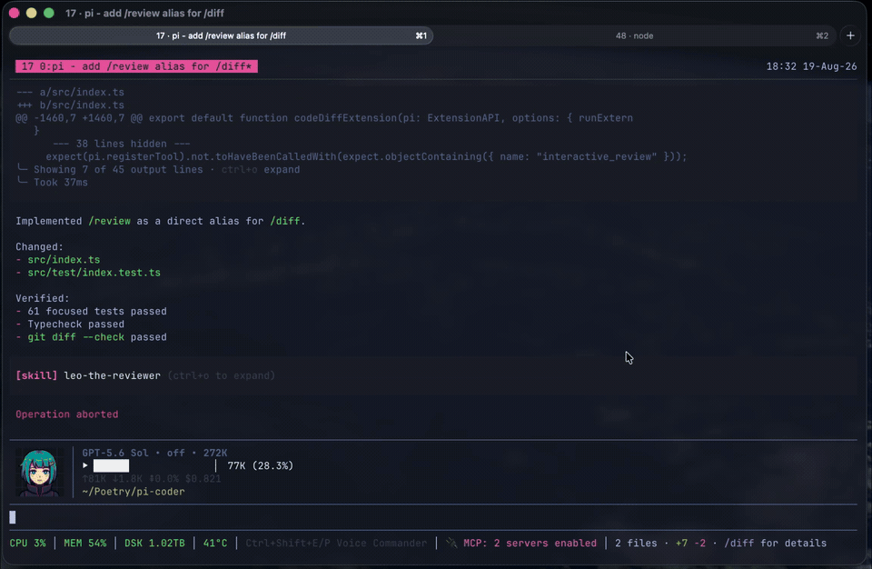
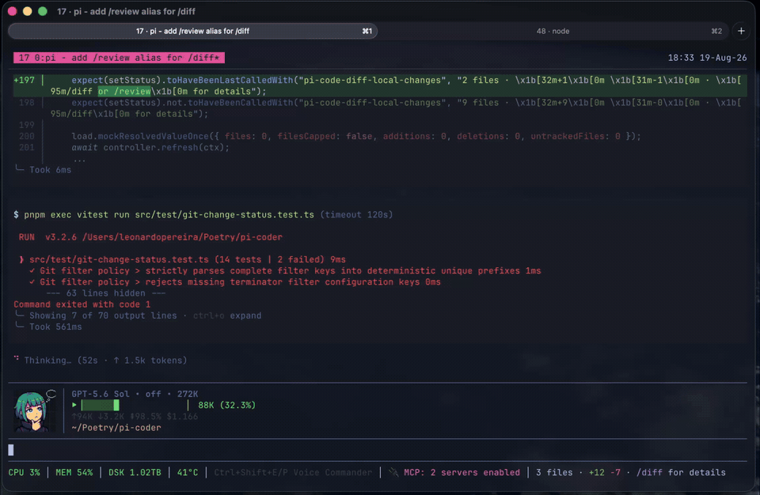

# pi-coder

`pi-coder` adds two coding tools to [Pi](https://github.com/badlogic/pi-mono):

- `/diff` and its `/review` alias review local changes, commits, branches, ranges, and configured remote pull requests.
- `/code` opens the built-in Workbench or your configured terminal editor.

It also keeps a compact repository summary in Pi's footer so you can see the current file count, additions, and deletions between reviews.

For a deeper walkthrough of the workflow, usage, and the engineering reasoning behind it, read [The Human in the Loop](https://blog.leonardopereira.com/2026/08/19/the-human-in-the-loop/).

## Install

```bash
pi install npm:pi-coder
```

To install the latest source directly from GitHub instead:

```bash
pi install https://github.com/dantetekanem/pi-coder
```

Restart Pi or run `/reload`.

## Review changes

Run `/diff` or `/review` inside a repository:

```text
/diff
/review
```

`/review` is an alias for `/diff`; both commands accept the same targets.



Useful targets:

```text
/diff                         # uncommitted changes
/diff main...HEAD             # a Git range
/diff remote <branch-or-url>  # a remote branch or configured pull request
/diff --resume                # a parked review
```

The review UI supports line, file, and review-wide feedback. Feedback can be marked as:

- `DISCUSS` — send the question back to the agent.
- `COMMENT` — keep review feedback for a local or remote review.
- `MODIFY` — propose or apply an exact code change.

GitHub pull requests work by default through the authenticated [`gh`](https://cli.github.com/) CLI. Confirmed reviews receive a grammar-safety pass before submission, and saved drafts are revalidated when the reviewed revision changes.

### Remote providers

After `gh auth login`, a GitHub URL works without configuration:

```text
/diff remote https://github.com/owner/repository/pull/123
```

Add other providers in `~/.pi/agent/pi-code-diff-settings.json`. Local settings extend the built-in GitHub provider; a local `providers.github` entry explicitly overrides it. Provider operations are executable-plus-argument arrays, never shell commands. Template values such as `{repo}`, `{number}`, `{branch}`, and `{payloadPath}` are passed as individual arguments.

```json
{
  "version": 1,
  "providers": {
    "secondary": {
      "label": "Secondary code host",
      "executable": "forge",
      "urls": {
        "patterns": [
          { "host": "code.example", "path": "/{repo}/change/{number}" }
        ],
        "canonical": "https://code.example/{repo}/change/{number}",
        "clone": "https://code.example/{repo}.git"
      },
      "operations": {
        "pullRequest": { "args": ["change", "show", "{repo}", "{number}"] },
        "reviews": { "args": ["change", "reviews", "{repo}", "{number}"] },
        "branchLookup": { "args": ["change", "list", "{repo}", "--head", "{branch}"] },
        "identity": { "args": ["identity", "--json"] },
        "submitReview": { "args": ["change", "review", "{repo}", "{number}", "--input", "{payloadPath}"] }
      },
      "refs": {
        "head": "refs/changes/{number}/head"
      },
      "fields": {
        "number": "id",
        "title": "subject",
        "body": "description",
        "additions": "metrics.added",
        "deletions": "metrics.removed",
        "changedFiles": "metrics.files",
        "author": ["actor.handle", "user.handle"],
        "state": "phase",
        "reviewState": "decision",
        "headRefName": "source.name",
        "headRefOid": "source.oid",
        "baseRefName": "target.name",
        "identityLogin": "login",
        "submissionId": "id",
        "submissionState": "state"
      },
      "capabilities": {
        "atomicReview": true,
        "baseRevisionRequired": false,
        "fileComments": false,
        "requestChangesBodyRequired": false,
        "validateSubmitResponse": true,
        "validateTargetBeforeSubmit": true
      }
    }
  },
  "repositories": {
    "owner/repository": {
      "cwd": "/absolute/path/to/checkout",
      "subdir": "packages/app",
      "pathspecs": ["packages/app", "shared/ui"],
      "importAliases": { "@shared": "shared/ui" }
    }
  }
}
```

`pullRequest` must return JSON addressable through the configured `fields`. `reviews`, `branchLookup`, reply operations, and repository profiles are optional. `submitReview` receives the generated review payload through `{payloadPath}`. Set `baseRevisionRequired` only when the provider returns and pins `baseRefOid`.

Common review controls:

| Key | Action |
| --- | --- |
| Arrow keys | Navigate files and diff lines |
| `c` / `d` | Add a comment / discussion |
| `Enter` or `m` | Edit the selected line |
| `v` | Toggle unified and side-by-side views |
| `s` | Finish the review |
| `Esc` | Go back or close safely |

## Browse and edit code

Open a workspace, or jump to a repository-relative file:

```text
/code
/code app/models/user.rb
```

The built-in Workbench remains the default. Install [TTT](https://github.com/eugenioenko/ttt) on macOS with `brew tap eugenioenko/ttt && brew install ttt`, then add this to `~/.pi/agent/pi-code-diff-settings.json` (or `PI_CODE_DIFF_SETTINGS_PATH`):

```json
{
  "version": 1,
  "code": {
    "version": 1,
    "opener": {
      "kind": "external",
      "executable": "ttt",
      "args": ["{cwd}"],
      "targetArgs": ["{file}:{line}"],
      "host": "auto"
    }
  },
  "providers": {},
  "repositories": {}
}
```

To use another editor, replace `opener` above:

- Fresh: `{"kind":"external","executable":"fresh","targetArgs":["{file}:{line}"],"host":"auto"}`
- Neovim: `{"kind":"external","executable":"nvim","targetArgs":["+{line}","--","{file}"],"host":"auto"}`

| Setting | Behavior |
| --- | --- |
| `code.version` | `1`; unknown versions or fields are rejected |
| `kind` | `workbench` (the default) or `external` |
| `executable` | External command resolved through absolute `PATH` entries |
| `args` / `targetArgs` | Optional always-added / target-only argv; placeholders are `{cwd}`, `{file}`, `{line}`, and `{endLine}` |
| `host` | `auto` (default), `current-terminal`, `tmux-auto`, or `herdr-auto` |

`auto` prefers Herdr when `HERDR_ENV` and `HERDR_PANE_ID` are set, then tmux when `TMUX` is set, then the current terminal. Explicit `*-auto` hosts also fall back to the current terminal when unavailable. Arbitrary shell hosts are intentionally unsupported; another pane manager needs a bounded adapter. All hosts block until closure is confirmed. Herdr uses a completion sentinel and cannot report the editor's exit status.

External editors require a TUI. Invalid settings, templates, executables, targets, symlink escapes, or anchor mismatches fail before the editor starts. A successful external return reports changes as unknown. The local `/diff` bridge saves its draft first, then resumes and revalidates after confirmed closure; it reopens immediately when nothing started and stays parked when closure is unconfirmed. Code stories, DISCUSS, and `/code syntax` remain Workbench-only.



`/code` fills the small gap between the coding agent and you. It is for the last 1% of the work, when you want to open the file yourself, read the code around it, make a small change, or point to exact lines and ask a question. Instead of leaving Pi or asking the agent to paste fragments into the conversation, you can work with the code directly and continue where you left off.

The built-in Workbench is not a replacement for Vim, Neovim, VS Code, or the editor you already use; configure `/code` to open that editor instead. The Workbench remains a small project explorer with readable source, search, and enough editing for focused changes. It protects unsaved work, will not overwrite a file changed somewhere else, and stays away from staging, commits, and pushes.

When the Workbench is selected, run `/code syntax` to choose and remember any syntax theme bundled with Shiki.

Common Workbench controls:

| Key | Action |
| --- | --- |
| Arrow keys or `j` / `k` | Navigate files and source lines |
| `Enter` | Open a file or enter INSERT mode |
| `Tab` / `Shift+Tab` | Move between Explorer and Source |
| `/` | Find a file or search the current buffer |
| `n` / `N` | Move through buffer matches |
| `Ctrl+S` | Save |
| `Esc` | Leave INSERT, return to Explorer, or close safely |

See [docs/workbench.md](docs/workbench.md) for the full Workbench behavior and standalone runner.

## Agent tools

Agents can use the same interfaces through:

- `open_code` — open the editor configured for `/code`; structured stories and DISCUSS use the built-in Workbench.
- `open_code_diff` — open `/diff` with an optional target and prepopulated comments.
- `submit_pr_review` — submit a confirmed configured-provider review.

## Development

```bash
pnpm install
pnpm typecheck
pnpm test
```

Build the standalone Workbench with `pnpm workbench:build`.

## Acknowledgments

Inspired by Mario Zechner's [pi-diff-review](https://github.com/badlogic/pi-diff-review), with thanks to [Rob Zolkos](https://github.com/robzolkos) for his contributing work on the review workflow.

## License

MIT
